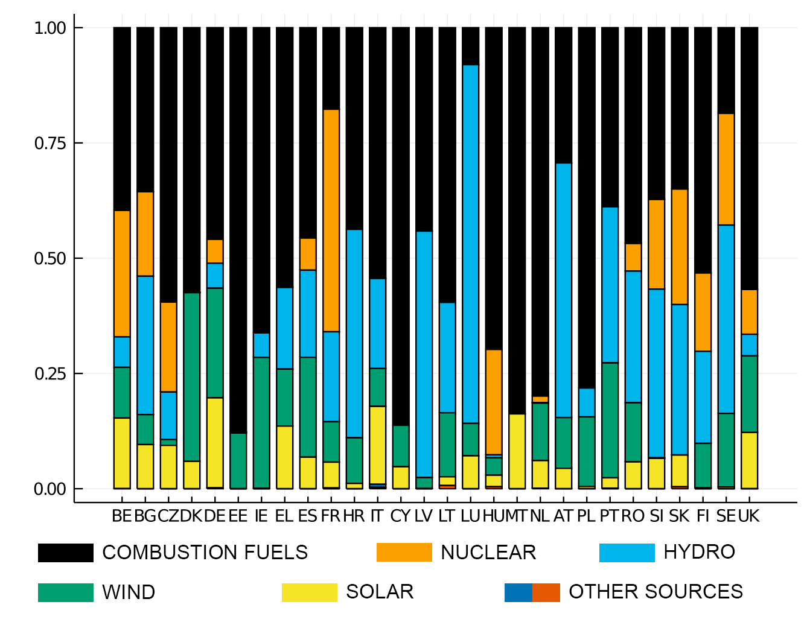
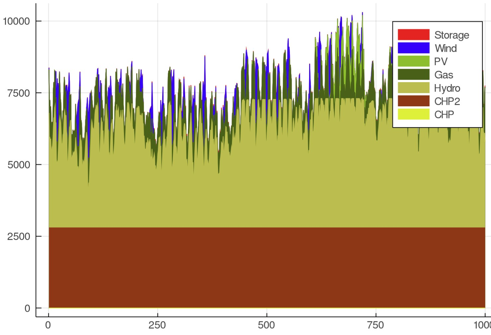

# Energy_capacity_expansion_model
The program is an energy production capacity expansion model. It uses real-world data of real-world countries that have been selected in a way that offers good overview to energy production situation in Europe.

Used data is handled in values.jl, the model is implemented in model.js and the model is launched and visualised in main.jl.

Here's the current situation of electiricty production methods used in European countries.

The model has showed realistic simulations regarding this.

DISCLAIMER:
Some parts of the data is generated using purely heuristic hand-waving methods and should not be concidered final.
